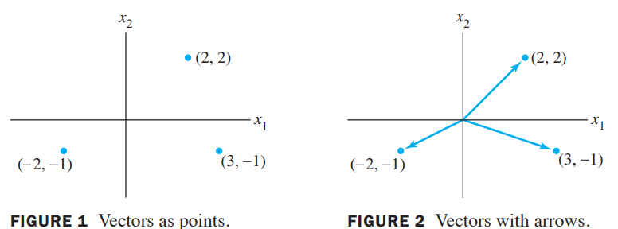
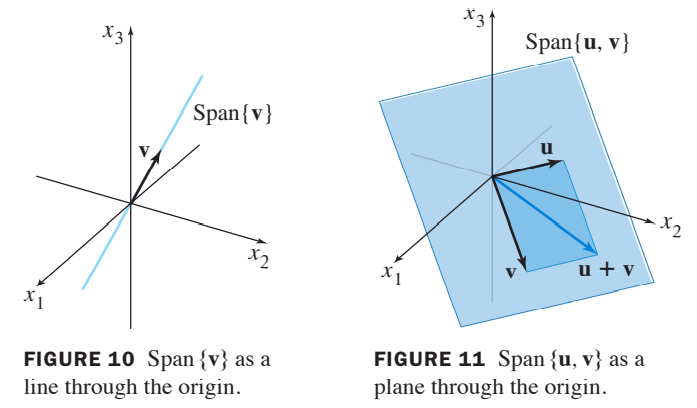
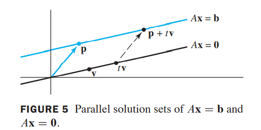
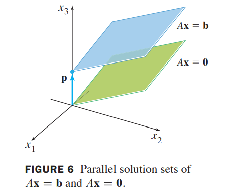
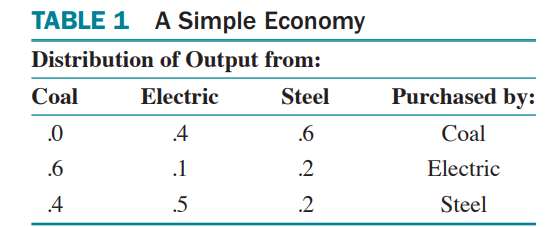

[TOC]

# linear algebra and its applications

# 一、线性代数中的线性方程组

# 1.1、线性方程组

## 1.基本概念

`线性方程：`

$$形如a_{1} x_{1}+a_{2} x_{2}+\cdots+a_{n} x_{n}=b,其中a_{n}和b是实数或者复数$$

`线性方程组：`

$$含有相同变量的线性方程的合集$$

`解集：`

$$线性方程组所以可能的解的集合$$

`等价：`

$$如果两个线性方程组有相同的解集，那么它们是等价的$$

`线性方程组的解：`

> - 没有解
> - 只有一个解
> - 无穷多解，

`相容：`

$$若线性方程组有一个解或无穷多解，那么它是相容的；若无解，则不相容 $$

## 2.矩阵表示

`系数矩阵`

`增广矩阵`

## 3.求解线性方程组

`基本事实：`

$对线性方程组中的方程操作相当于是对增广矩阵的行操作$

`初等行操作：`

> - (行替换)把另一行的倍数加到该行的结果取代该行
> - (互换)行之间互相交换
> - (缩放)该行乘上某个非0常数

**注**：行操作是<u>可逆</u>的

`行等价：`

> 通过一系列的初等行操作把一个矩阵变换成另一个矩阵，则称此两矩阵行等价-->如果两个线性方程组的增广矩阵是行等价的，那么该两线性方程组有相同的解集

# 1.2、行简化及阶梯形

## 1.基本概念

`leading entry:`

在非零行中，最左边非0的元素

`阶梯形(或行阶梯形)：`

> - 所有非零行都在所有全0行的上面
> - 每行的leading entry所处的列都在它上面一行leading entry所处列的右边
> - 每列在leading entry下面的所有entry都是0(前一条的直接结果，此处用于强调)

`简化阶梯形：`

> 在满足阶梯形的条件下，在满足：
>
> - 每非零行的leading entry是1
> - 每个leading entry是所在列唯一的非0元素

## 2.定理

`定理1：`

> 简化阶梯形的唯一性：
>
> 每个矩阵都跟它有且仅有的简化阶梯形行等价

`定理2：`

> 存在性和唯一性定理：
>
> - 一个线性方程组是相容的当且仅当增广矩阵的最右边的一列不是主列，即是，当且仅当增广矩阵的阶梯形没有形如$$[0 \cdots 0\;b](b非0)$$的行
> - 如果线性方程组相容，那么解集$$(i)没有自由变量时，唯一解\;或(ii)至少有一个自由变量时，无穷多解$$

## 3.求解线性方程组

`解线性方程组：`

> 1. 写出方程组的增广矩阵
> 2. 利用行化简算法获取阶梯形的等价的增广矩阵。判断方程组是否相容。如果无解，止步；否则，进行下一步
> 3. 继续使用行简化算法获取简化阶梯形
> 4. 写出对应的方程
> 5. 重写每个非零行的方程使得基本变量由自由变量表示

# 1.3、向量方程

## 1.基本概念

`向量：`有序数字列表

`列向量和行向量：`(3,-1)表示列向量(节省空间)，[3 -1]是行向量

`平行四边形法则：`

`线性组合：`

给定在$R^n$中的向量$v_1,v_2,...,v_p$和标量$c_1,c_2,...c_p$,形如
$$
y=c_1\boldsymbol v_1+...+c_p\boldsymbol v_p
$$
称为一个线性组合.

`张量：`

$$Span \{\boldsymbol v_1,...,\boldsymbol v_p\}等价于$$
$$
c_1\boldsymbol v_1+c_2\boldsymbol v_2+...+c_p\boldsymbol v_p
$$
其中，$$c_1,...c_p为标量$$

$$R^n空间中的向量：$$

`性质:`

## 2.求解向量方程

形如向量方程
$$
x_1\boldsymbol a_1+x_2\boldsymbol a_2+...+x_n\boldsymbol a_n=b
$$
跟线性方程组
$$
[\boldsymbol a_1\ \boldsymbol a_2\ ...\ \boldsymbol a_n\ \boldsymbol b]
$$
同解。

## 3.图像描述

$$R^2的图像描述：$$

$$Span\{ \boldsymbol v\}和Span\{\boldsymbol u,\boldsymbol v\}的图像描述$$

# 1.4、矩阵方程$$A\boldsymbol x=\boldsymbol b$$

## 1.基本概念

`矩阵方程：`

如果$$A$$是一个列为$$\boldsymbol a_1,...\boldsymbol a_n$$且大小为$$m*n$$的矩阵，如果$$\boldsymbol x$$在$$R^n$$中，那么$$A$$和$$\boldsymbol x$$的乘积是$$A$$列的线性组合，对应的$$x$$元素作为权值，即
$$
A \mathbf{x}=\left[\begin{array}{llll}
\mathbf{a}_{1} & \mathbf{a}_{2} & \cdots & \mathbf{a}_{n}
\end{array}\right]\left[\begin{array}{c}
x_{1} \\
\vdots \\
x_{n}
\end{array}\right]=x_{1} \mathbf{a}_{1}+x_{2} \mathbf{a}_{2}+\cdots+x_{n} \mathbf{a}_{n}
$$
注：当$$A$$列的数目和$$x$$元素数目相等时$$A\boldsymbol x$$才有定义

`单位矩阵：`

对角线上全是1，其余全为0

注：$I_n\boldsymbol x=\boldsymbol x$对$R^n$中的任一$\boldsymbol x$成立

## 2.解集的存在性

当且仅当$$\boldsymbol b$$是A的列的线性组合时方程$$A\boldsymbol x=\boldsymbol b$$有解

## 3.定理

`定理三：`

> 如果$$A$$是一个列为$$\boldsymbol a_1,...\boldsymbol a_n$$且大小为$$m*n$$的矩阵，如果$$\boldsymbol b$$在$$R^m$$中，那么矩阵方程
> $$
> A\boldsymbol x=\boldsymbol b
> $$
> 跟向量方程
> $$
> x_1\boldsymbol a_1+x_2\boldsymbol a_2+...+x_n\boldsymbol a_n=\boldsymbol b
> $$
> 有相同的解集，跟增广矩阵
> $$
> [\boldsymbol a_1 \ \boldsymbol a_2 \ ...\ \boldsymbol a_n \ \boldsymbol b]
> $$
> 解集相同。

`定理四：`

> $$A$$是一个$$m\times n$$大小的矩阵。下面的命题是逻辑等价的，即，要么都对，要么都错
>
> 
>
> $$a$$.对于在$$R^m$$中的任一$$\boldsymbol b$$，方程$$A\boldsymbol x=\boldsymbol b$$有解
>
> 
>
> $$b$$.在$$R_m$$中的任一$$\boldsymbol b$$都是$$A$$的列的一个线性组合
>
> 
>
> $$c$$.$$A$$的列张量$$R^m$$
>
> 
>
> $$d$$.$$A$$在每行都有一个主元

**注：**定理四是关于**系数矩阵**，而不是增广矩阵

**证明：**

> 令$$U$$作为$$A$$的阶梯型.给定在$$R^m$$中的$$\boldsymbol b$$,我们可以行简化增广矩阵$$[A \ \boldsymbol b]$$到另一个增广矩阵$$[U \ \boldsymbol d]$$,$$d$$在$$R^m$$中:
> $$
> \left[\begin{array}{ll}
> A & \mathbf{b}
> \end{array}\right] \sim \cdots \sim\left[\begin{array}{ll}
> U & \mathbf{d}
> \end{array}\right]
> $$
> 如果$$d$$是对的，那么$$U$$的每行都有一个主元以及在**增广列**没有主元.所以对任意$$\boldsymbol b$$，$$A\boldsymbol x=\boldsymbol b$$有解，因此$$a$$是对的。如果$$d$$是错误的，那么$$U$$的最后一行都是0.令$\boldsymbol d$的最后一个元素为1.那么$[U \ \boldsymbol d]$表示的是一个不相容的方程组.既然行操作是可逆的，那么$[U \ \boldsymbol d]$能被转换成$[A \ \boldsymbol b]$.方程$A\boldsymbol x=\boldsymbol b$不相容，因此$a$是错误的。

`定理五：`

如果$A$是一个$m\times n$大小的矩阵，$\boldsymbol u$和$\boldsymbol v$都在$R^n$中，$c$是一个标量，那么：

$a.A(\boldsymbol u+\boldsymbol v)=A\boldsymbol u+A\boldsymbol v$

$b.A(c\boldsymbol u)=c(A\boldsymbol u)$

# 1.5、线性方程组的解集

## 1.齐次线性方程组

`齐次线性方程组：`

> - 如果一个线性方程组能够写成$A\boldsymbol x=\boldsymbol 0$的形式，其中$A$是一个$m\times n$的矩阵，$\boldsymbol 0$是$R^m$中的零向量，那么我们说该方程组是**齐次**的
> - 这类方程组至少有一个解，即$\boldsymbol x=\boldsymbol 0$($R^n$中的零向量)，称为**平凡解**
> - 事实：当且仅当齐次线性方程组至少有一个自由变量时，才有**非平凡解**

`齐次线性方程组的解集：`

> - 总可以表示成$Span\{\boldsymbol v_1,...,\boldsymbol v_p\}$的形式，当唯一解为零向量时，解集为$Span\{\boldsymbol 0\}$
> - 只有一个自由变量时，解集为过原点的直线
>
> 
>
> 
>
> - 即使$\boldsymbol u,\boldsymbol v$不是$A\boldsymbol x=\boldsymbol 0$的解，当合适的时，$Span\{\boldsymbol u,\boldsymbol v\}$也可表示解集的图像

## 2.非齐次线性方程组

`非齐次线性方程组：`

当一个非齐次线性方程组有多个解时，通解可以用参数向量的形式写成一个向量加上满足相应齐次方程组的向量解的任意线性组合。

($A\boldsymbol x=\boldsymbol b$相容时)

## 3.定理

`定理6：`

给定$\boldsymbol b$，假设$A\boldsymbol x=\boldsymbol b$是相容的，令$\boldsymbol p$为一个解。那么$A\boldsymbol x=\boldsymbol b$的解集是$\boldsymbol w=\boldsymbol p+\boldsymbol v_h$,其中$\boldsymbol v_h$是$A\boldsymbol x=\boldsymbol 0$的任意解

## 4.以参数向量的形式写解集

`参数向量形式：`

形如$\boldsymbol x=s\boldsymbol u+t\boldsymbol v$($s,t在R中$)

> 1. 行化简增广矩阵为简化阶梯形。
> 2. 用表达式中出现的任意自由变量来表示每个基本变量方程。
> 3. 将一个典型解x写成一个向量，它的项依赖于自由变量，如果有的话。
> 4. 将x分解为向量的线性组合(带数字项)使用自由变量作为参数。

# 1.6、线性方程组的应用

## 1.经济学中的齐次方程组

$$
p_c=.4p_E+.6p_s\\p_E=.6p_c+.1p_E+.2p_s\\p_s=.4p_c+.5p_E+.2p_s
$$

## 2.配平化学方程式

$$
(x_1)C_3H_8+(x_2)O_2-->(x_3)CO_2+(x_4)H_2O
$$

以碳(C)氢(H)氧(O)的顺序给每个反应物和生成物排序：
$$
C_3H_8:\left[\begin{array}{l}
3 \\
8 \\
0
\end{array}\right], \; O_2:\left[\begin{array}{l}
0 \\
0 \\
2
\end{array}\right],\; CO_2: \left[\begin{array}{l}
1 \\
0 \\
2
\end{array}\right],\; H_2O:\left[\begin{array}{l}
0 \\
2 \\
1
\end{array}\right]
$$

## 3.网络流

| Intersection |     Flow in     |   Flow out    |
| :----------: | :-------------: | :-----------: |
|      A       |     300+500     |   $x_1+x_2$   |
|      B       |    $x_2+x_4$    |   300+$x_3$   |
|      B       |     100+400     |   $x_4+x_5$   |
|      D       |    $x_1+x_5$    |      600      |
|   **All**    | 500+300+100+400 | 300+$x_3$+600 |

# 1.7、线性无关

