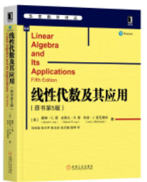

# Linear-Algebra-and-Its-Applications

English ｜ [中文(简体)](README-zh-CN.md)

## Introduction

This repo is for Linear Algebra and Its Application textbook

textbook resource site: [here](https://wps.pearsoned.com/aw_lay_linearalgebra_5/)

English version and Chinese version are as follows:

    &nbsp;&nbsp;&nbsp;
    

## Folder Clarification

**LayData5_toolbox:** Contains data for about 900 numerical exercises in the text, Case Studies, and Application projects.(MTLAB program)

**application:** Contains individual application files

**case_study:** Contains Case Study files for each chapter

**project:** Contains individual project files

**solutions**: solution manual for the exercises after each section

**textbook:** English-pdf version, including online chapter 9 and 10

**exercise:** Written in Chinese, including some important exercises from the book

## Personal Notes

You can fine my notes [here](https://ascendho.github.io/Linear-Algebra-and-Its-Applications/) (In Chinese), continue updating...

## Waiting to Build

**Review Sheets** and **Practice Exams**

## LICENSE

- This repo is under <a href="https://github.com/ascendho/The-Economist-Sharing/blob/master/LICENSE">MIT LICENSE</a>
- For any materials involved in this repo, if you feel you have been infringed, please just [email](mailto:ascendho@outlook.com) me
- The articles and audios are just for self-reading and learning, commercial activities are **forbidden**
