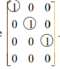

31. 设$A$是一个$3\times2$的矩阵。解释一下为什么方程$A\boldsymbol x=b$对$R^3$中的所有$b$不可能都是相容的。将你的论点推广到行多于列的任意$A$的情况。

$$
A只有两列，因此最多只有两个主元。根据定理4，不可能都相容\\推论：如果行数大于列数，A\boldsymbol x=\boldsymbol b不可能对任意\boldsymbol b相容
$$

33. 设$A$是一个$4\times3$的矩阵，$\boldsymbol b$是$R^4$中的一个向量，且$A\boldsymbol x=\boldsymbol b$有唯一解。$A$的简化阶梯性有什么性质？

34. 设$A$是一个$3\times 3$的矩阵且$\boldsymbol b$是$R^3$中的一个向量，若$A\boldsymbol x=\boldsymbol b$有唯一解。解释为什么$A$的列向量能张成$R^3$。

$$
有唯一解-->无自由变量，所以A的每列都是一个主列，\\所以A的简化阶梯形是一个3\times 3的单位矩阵，所以A在每行都有主元。\\由定理4，A的列向量张成R^3
$$

